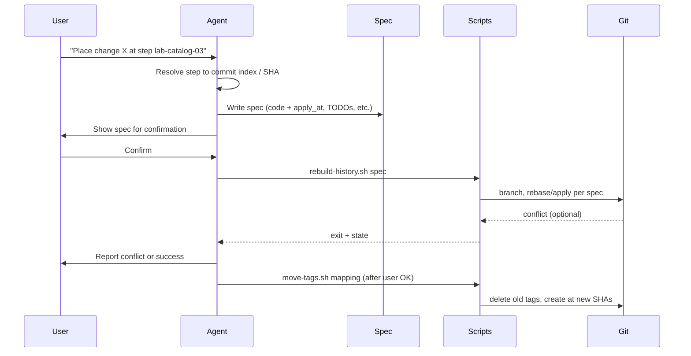

# Commit History Refactor: Agent Skill, Rules, and Workflow

## Context

- **Repo**: Next.js course-lab with ~27 commits and 53 Git tags; each commit (or step) is a hands-on exercise milestone.
- **Constraints**: Exact commit history matters (tags like `lab-catalog-01`…`lab-catalog-complete` drive README compare links). TODOs are introduced early/interstitially and later replaced by code.
- **Goal**: Reduce manual “checkout each commit → edit → rebase” work by giving the agent clear workflows and, where useful, scripts.

## Deliverables


| Deliverable                                    | Purpose                                                                                                                                         |
| ---------------------------------------------- | ----------------------------------------------------------------------------------------------------------------------------------------------- |
| **1. Skill** (primary)                         | Teaches the agent the full workflow: interpret “where” in history, produce a spec, drive or guide rebuild and tag migration.                    |
| **2. Rule** (optional)                         | When editing this repo, remind the agent about history-sensitive edits and point to the skill.                                                  |
| **3. Scripts** (optional, in skill or project) | Automate rebase/apply and tag migration where possible; keep logic in scripts so the agent runs them instead of hand-holding every git command. |


No Cursor-specific “commands” API was found; the agent is invoked via natural language and the **skill’s description + instructions** act as the “commands” (e.g. “refactor commit history”, “place this change at step X”, “rebuild history and move tags”).

---

## 1. Skill: `refactor-lab-commit-history`

**Location**: Project-scoped so the whole team gets it: `[.cursor/skills/refactor-lab-commit-history/](.cursor/skills/refactor-lab-commit-history/)`

**Role**: Single place for “what to do” and “how to do it” for history refactors.

### 1.1 Description (for discovery)

Short, third-person, WHAT + WHEN, with trigger terms:

- **WHAT**: Specifies where code changes and TODO comments belong in a linear commit history, then rebuilds that history (rebase/cherry-pick), handles conflicts, and re-applies Git tags to the new history after user confirmation.
- **WHEN**: User mentions refactoring commit history, placing changes in specific commits/steps, adding or replacing TODOs across history, upgrading dependencies at the start of history, or moving tags after a rebase in a course-lab or training repo.

### 1.2 Core instructions (in SKILL.md)

- **History model**: Explain that commits are ordered steps; identify steps by commit index (1 = root), by tag (e.g. `lab-catalog-02`), or by message substring. Tags are immutable pointers; after a rebase, old tags still point to old SHAs until explicitly moved.
- **Three phases**:
  1. **Spec phase**: User provides (a) code changes and “where” they apply (commit/step/tag or range), and/or (b) multi-line comments: where they are introduced and what code later replaces them. Agent produces a **structured spec** (see below).
  2. **Rebuild phase**: From the spec, either run provided scripts or follow step-by-step (checkout base, replay commits with edits, or rebase with `--exec` / custom script). Resolve conflicts when they appear; document how and where.
  3. **Tag phase**: After rebuild, list old tag → old SHA vs new SHA (or “no longer exists”). Ask user to confirm, then delete old tags and create new ones pointing to the new history (script or explicit commands).
- **Conflict handling**: If rebase stops due to conflict: (1) show status and conflicted files, (2) guide resolution (or apply resolution from spec if applicable), (3) `git add` and `git rebase --continue` (or abort and report). Never force-push or rewrite shared branches without explicit user confirmation.
- **Safety**: Work on a dedicated branch; avoid rewriting `main` in-place until user confirms. Recommend backup branch or clone for first run.

### 1.3 Structured spec format (for machine and human)

So the agent (and optional scripts) can consume it:

- **Code changes**: List of `{ "path": "app/...", "patch" or "content", "apply_at": "commit_index" | "tag" | "after_tag" }`. Optionally “apply from commit X through Y” for range.
- **TODO comments**: List of `{ "introduce_at": "commit_index" | "tag", "file": "...", "comment_text": "..." }` and `{ "replace_at": "commit_index" | "tag", "file": "...", "comment_text": "...", "replacement_code": "..." }`. Introduce and replace can be in same or later commits.
- **Dependency upgrades**: Treated as a single “code change” with `apply_at` = first commit (or “root”) so it appears at the beginning of history.

Keep SKILL.md under ~400 lines; put detailed examples and edge cases in `examples.md` and script usage in `reference.md`.

### 1.4 Optional scripts (in skill or repo)

- `**scripts/rebuild-history.sh**` (or `.js`/`.ts`): Input = path to a spec file (JSON/YAML). Logic: ensure clean state, create backup branch, determine base (e.g. root), then for each commit in order either apply patches from spec at that commit index or run a small “apply edits for this step” helper. Use `git rebase --onto` or a loop of cherry-pick + amend / apply patch. On conflict, exit with message and leave repo in rebase state for user/agent to fix.
- `**scripts/move-tags.sh**`: Input = mapping file (old_tag → new_sha). Delete old tags, create new tags at new SHAs; optionally push tags (with user confirmation). Script avoids the agent having to remember exact git tag syntax and reduces errors.

Scripts make the workflow repeatable and the skill text shorter; the skill describes when to run them and how to prepare inputs (e.g. “generate spec from user message, write to `history-refactor-spec.json`, run `./scripts/rebuild-history.sh history-refactor-spec.json`”).

---

## 2. Rule: history-aware edits (optional)

**Location**: `[.cursor/rules/history-aware-edits.mdc](.cursor/rules/history-aware-edits.mdc)`

**Scope**: `alwaysApply: true` for this repo (or `globs: **/*` if you prefer only when any file is open).

**Content**: 2–4 short bullets: (1) Commit history is intentional; each commit is a lab step. (2) For changes that should appear in specific steps or that add/replace TODOs across history, use the “refactor lab commit history” skill and specify where changes belong. (3) Dependency upgrades should be applied at the beginning of history. (4) Do not rewrite history (rebase/force-push) without explicit user confirmation.

This keeps the rule under 50 lines and defers procedure to the skill.

---

## 3. Workflow summary (for the skill)




---

## 4. File layout

```
.cursor/
  rules/
    history-aware-edits.mdc          # Optional rule
  skills/
    refactor-lab-commit-history/
      SKILL.md                       # Main instructions, spec format, 3 phases
      reference.md                  # Script options, env vars, edge cases
      examples.md                   # Example specs and prompts
      scripts/
        rebuild-history.sh          # Optional: spec-driven rebase
        move-tags.sh                # Optional: tag migration
```

If scripts live in the repo root (e.g. `scripts/` next to `app/`) for visibility, the skill can reference them as `scripts/rebuild-history.sh` and `scripts/move-tags.sh`.

---

## 5. Implementation order

1. **Skill skeleton**: Create `.cursor/skills/refactor-lab-commit-history/` with SKILL.md (frontmatter + three phases + spec format + conflict handling + safety). No scripts yet.
2. **Examples**: Add `examples.md` with 2–3 concrete scenarios (e.g. “add a comment at lab-catalog-02, replace it at lab-catalog-05”; “bump Next.js at root”).
3. **Optional scripts**: Implement `rebuild-history` and `move-tags` and document in `reference.md`; skill instructs agent to generate spec then run scripts when available.
4. **Rule**: Add `history-aware-edits.mdc` so the agent is nudged to use the skill when editing this repo.
5. **Verification**: Run through one scenario manually (e.g. “add a TODO at step 5, replace at step 8”) using only skill instructions; then with scripts if added.

---

## 6. Out of scope / limitations

- **Cursor “commands”**: Represented as natural-language triggers and skill steps; no separate command palette entry unless Cursor adds that later.
- **Full automation of conflict resolution**: Agent + scripts can detect and pause on conflicts and guide resolution; automatic resolution for arbitrary conflicts is not guaranteed.
- **Other repos**: Skill is project-scoped; copy or adapt the skill to other course repos if needed.

---

## 7. Summary


| Item          | Action                                                                                                                 |
| ------------- | ---------------------------------------------------------------------------------------------------------------------- |
| **Skill**     | Create `refactor-lab-commit-history` with spec format, 3 phases (spec → rebuild → tags), conflict and safety guidance. |
| **Rule**      | Optional `history-aware-edits.mdc` to remind the agent about history-sensitive edits in this repo.                     |
| **Scripts**   | Optional `rebuild-history.sh` and `move-tags.sh` to automate rebase and tag migration from a spec.                     |
| **Discovery** | Skill description includes “refactor commit history”, “place changes in commits”, “TODOs”, “tags”, “course-lab”.       |


This gives the team a single, reusable workflow: specify where changes and comments go, then rebuild history and move tags with minimal manual checkout/rebase steps, and with clear handling for conflicts and safety.